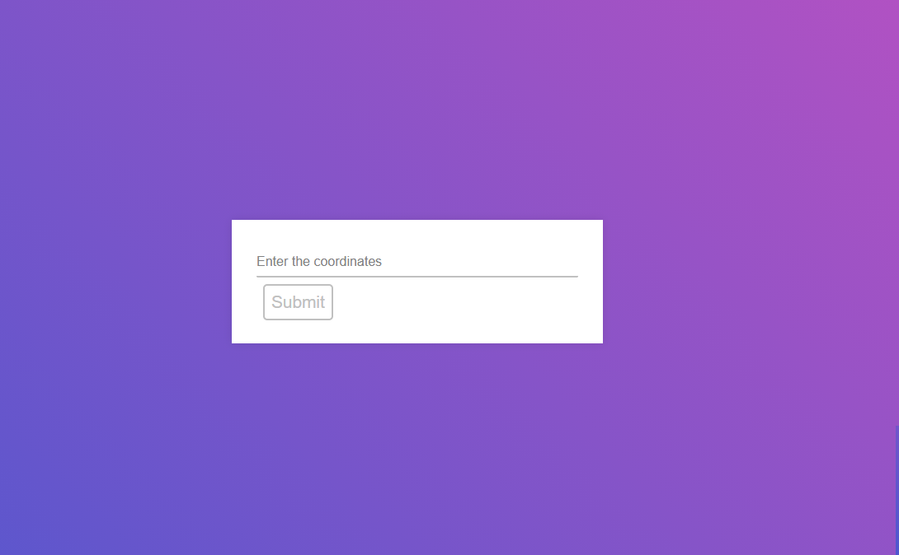
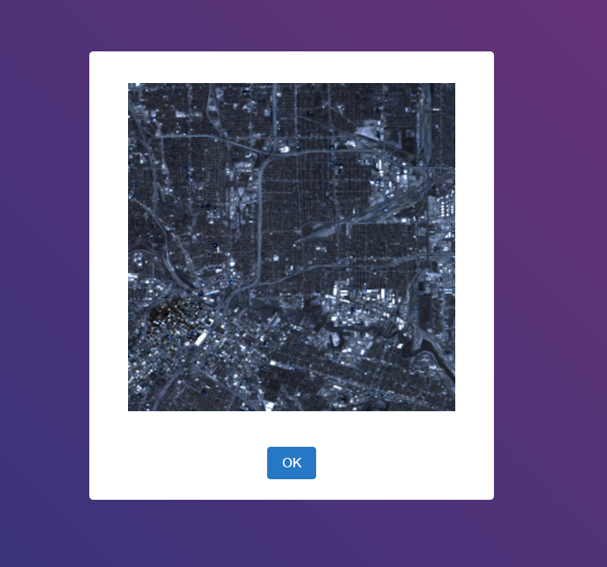

# nasahomework

## To run this project:

Assuming you have installed node.js you have to do this steps:

-Go to your app directory

-In the command line type `npm install express` if you dont have installed express 

-Then type `npm install` to install all the dependencies especified on the package.json

-Then type `node app.js` to start the server

-then go to your browser to `http://localhost:3000` to view the site

You should see this page:

then in the tex field input, you should put the coordinates you what
in this order (latitude,longitude)
for example: `29.78,-95.33`

then a popup will come out and you just have to wait until the image appears

